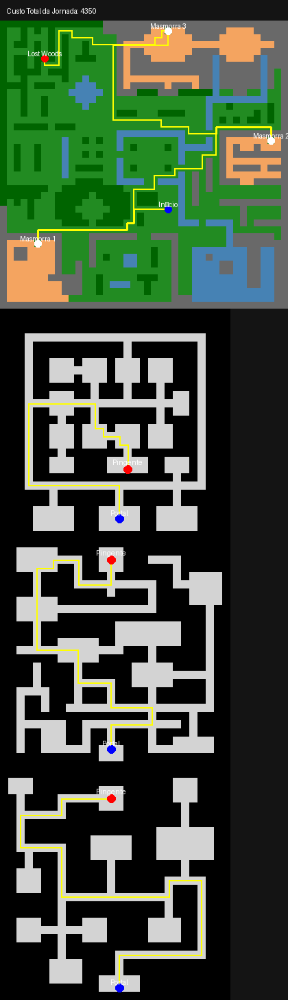

# Busca Heurística Zelda

Este projeto implementa um algoritmo de busca heurística (A*) para encontrar o caminho mais curto em um ambiente semelhante ao de Zelda.

## Representação Visual

## Arquivos:

- `a_star.py`: Contém a implementação do algoritmo de busca A*.
- `main.py`: Script principal para executar a busca e visualizar o caminho.
- `map_data.py`: Lida com o carregamento e os dados do mapa.
- `maps/`: Diretório contendo vários arquivos de mapa (por exemplo, `dungeon1_map.csv`, `hyrule_map.csv`).
- `instructions/instructions.pdf`: Instruções do projeto.